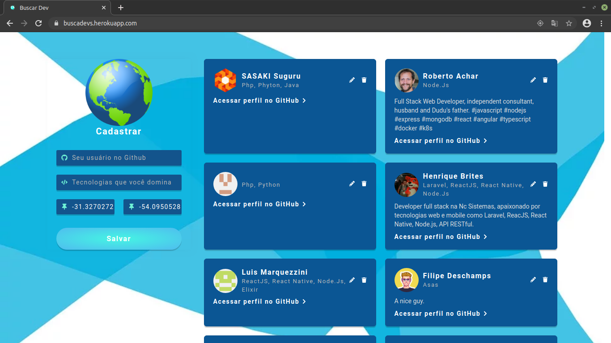
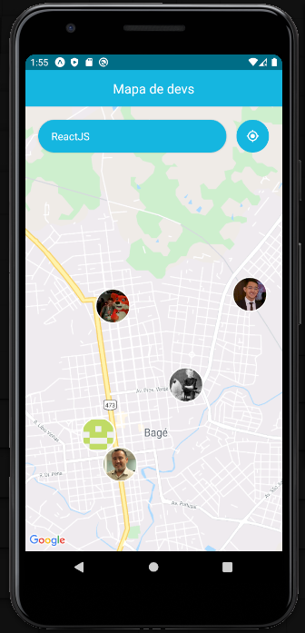

# Semana OmniStack 10.0 da Rocketseat :rocket:

## :rocket: Tecnologias usadas
Este maravilhoso projeto foi desenvolvido com as seguintes tecnologias:
- [Node.js](https://nodejs.org/en/)
- [React](https://reactjs.org)
- [React Native](https://facebook.github.io/react-native/)
- [Expo](https://expo.io/)

## :computer: Projeto

O DevRadar é um projeto que visa conectar desenvolvedores com clientes por meio da localidade, em um raio de 10km.

## :mortar_board: Quem ministrou?

A semana foi ministrada pelo Mestre Jedi [Diego Fernandes](https://github.com/diego3g)

## Como usar

- clone este repositório
- entre na pasta do projeto
- digite `yarn` para instalar as dependências
- digite `yarn start:web` para iniciar o projeto web
- digite `yarn start:mobile` para iniciar o projeto mobile (lembre-se de mudar o IP de conexão do expo no mobile)
- digite `yarn start` para iniciar o projeto web e mobile

## Imagens

  
  

## :memo: Licença

Esse projeto está sob a licença MIT. Veja o arquivo [LICENSE](LICENSE) para mais detalhes.

---

Feito com :purple_heart: by  Henrique Brites :wave:
